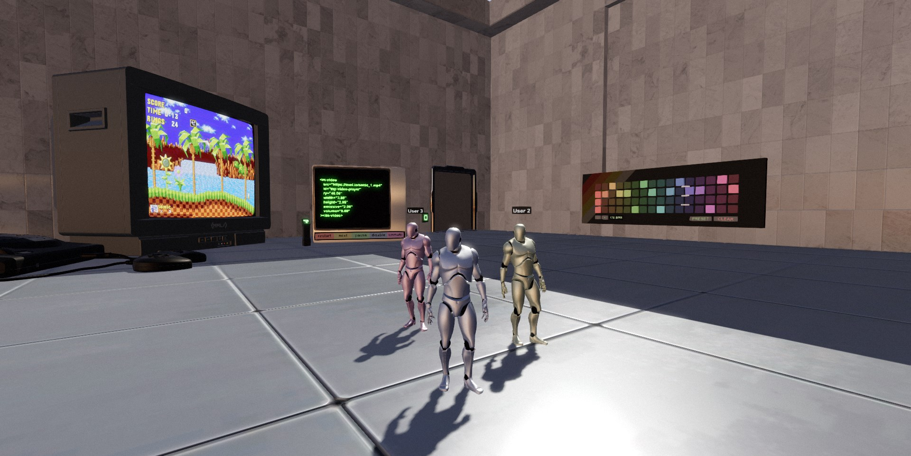

# MML Guided Tour

This project implements the MML Guided Tour powered by
[MML (Metaverse Markup Language)](https://mml.io/) and the
[(MML) 3D Web Experience](https://github.com/mml-io/3d-web-experience) project. It serves as a great
starting point to create your own end-to-end live, multiplayer experience using the the unique,
real-time nature of MML.

It can be easily deployed to environments that support Node.js and expose ports to the internet.



## Main features

- Multiple players can connect to the Guided Tour and interact with it in real time.

- The MML-based Guided Tour showcases example MML documents in the defined slots.

- Players can interact with any of the showcased documents simultaneously.

## Project structure:

The project contains the following packages:

- [`server`](./packages/server): an ExpressJS server which serves the page and handles all WebSocket
  connections using the `@mml-io/3d-web-experience-server` package from
  [(MML) 3D Web Experience](https://github.com/mml-io/3d-web-experience).

- [`web-client`](./packages/web-client): implements the browser-based 3d experience by using the
  `@mml-io/3d-web-experience-client` package from
  [(MML) 3D Web Experience](https://github.com/mml-io/3d-web-experience).

## Run on CodeSandbox

Click the button below to create a new sandbox on CodeSandbox.io (It might take a minute or two to
install dependencies).

[](https://codesandbox.io/p/github/mml-io/mml-guided-tour)

## Running locally

Making sure you have Node.js installed, run the following from the root of the repository:

```bash
npm install
npm run iterate
```

Once the server is running, open `http://localhost:8080` in your browser.
